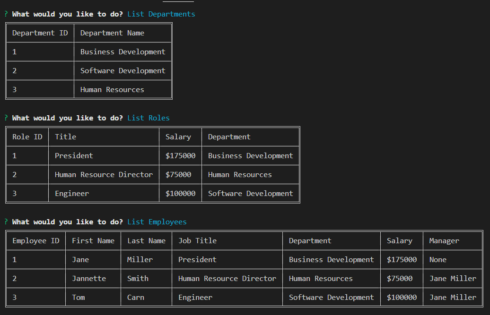
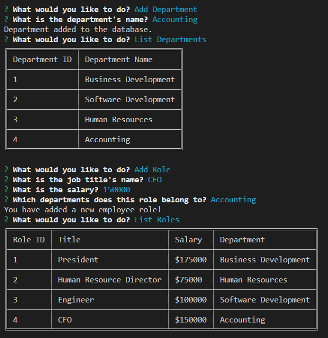
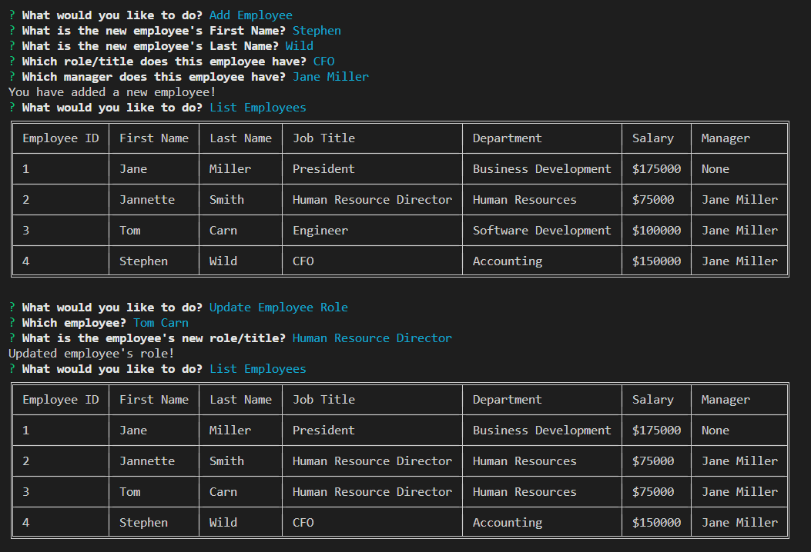
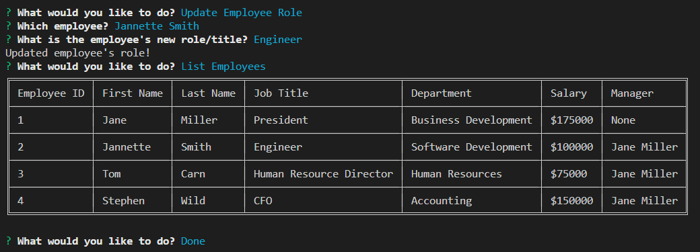

# SQL-Employee Tracker

The SQL-Employee Tracker Content Management System is desidgned to allow non-developers to view and interact with employee, department and employee role information stored the company dadatabase.  

## Table of Contents 
- [Application Image](#application-image)
- [Installation Instructions](#installation)
- [Instructions](#instructions--usage)
- [Usage Video](#usage-video)
- [License](#license)
- [Questions](#questions)

## Application Image 

## Installation Instructions
To install the application, you would download the SQL-EmployeeTracker repository (https://github.com/MicheleTornetta/SQL-EmployeeTracker).  User will need to download and install the MySql developer addition.  From there you would navigate to the directory in the command terminal.  Once there the user will need to type in "npm i" to download the dependencies. 

## Instructions
Once dependecies are dowloaded, in the index.js open integrated terminal (which the user can access by right clicking on the index.js file and choosing Open in Integrated terminal), and type in node index. Then the user will be prompted to choose from an option menu by using the arrow keys to scroll up and down and once one the desired option hit enter.  Then the user may be promped to answer some basic questions to add information to the database.  

## Usage Video
An example of how it works can be viewed here: 
[Watch the video](https://www.youtube.com/watch?v=paMvMTBh6Fs){:target="\_blank"}

## License 
A short, permissive software license. Basically, you can do whatever you want as long as you include the original copyright and license notice in any copy of the software/source.  There are many variations of this license in use.

## Questions
If you would like to contribute or you simply have questions, please visit: 

https://github.com/MicheleTornetta

or email me at:
mlt@pwahsolutions.com
